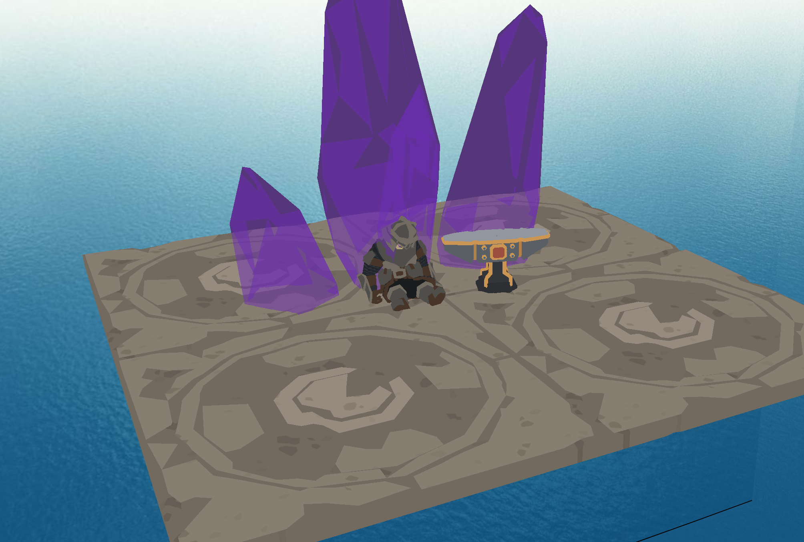

# Sea Engine

Sea Engine is a game engine built using C++ and a mix of tools/api like OpenGL and ImGui. It is far from finished and still in development. Sea Engine was originally a school project for my C++ graphics class but grew into a fun side project that is meant to be more hands on than other engine. A deep understanding of C++ is recommended.

_Above Image includes models NOT included with the engine due to licencing. More images [here](Gallery)_

I plan to support other model formats since **_.ply_** is the only accepted format. The next thing I want to add is collision and reformat how light objects are handled to make scripting easier.

### Basic Controls

| Action | Key(s)                          |
|---|---------------------------------|
| Rotate Camera | `Hold Right Click` + `Move Mouse` |
| Movement | `W` `A` `S` `D` `Q` `E`              |
| Camera Speed | `Scroll Wheel`                  |
| Cycle Objects | `Shift` + `[` or `]`                |
| Object Movement | `Shift` + `Movement`              |
| Object Rotation | `ALT` + `Movement`                |
| Highlight Object | `Shift` + `T`                     |
| Duplicate Object | `Shift` + `M`                     |
| Delete Object | `Shift` + `Backspace`             |
| Cycle Lights | `Shift` + `[` or `]`                |
| Light Movement | `CTRL` + `Movement`               |
| Highlight Light | `CTRL` + `T`                      |

Note: This repo is the development build, meaning it will contain a lot of random assets, textures, and scenes meant to assist development. Any release version will have these assets removed, so your own assets are required.
